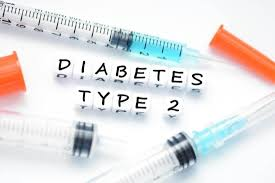

## Diabetes Classification

## 📝 Table of Contents

1. [ Project Overview ](#introduction)
2. [ Business Understanding ](#arch)
3. [ Web Scrapinng ](#webscraping)
4. [ Data Cleaning](#dataedamodel)
5. [ Exploratory Data Analysis ](#installation)
6. [ Modelling ](#refs)
7. [ Contact ](#contact)

## 🔬 Project Overview

### 🎯 Goal :

The project focuses on classifying diabetes cases through data analysis and machine learning. It involves exploring the dataset, performing feature engineering, and building classification models. The goal is to accurately predict diabetes presence based on health indicators, while also evaluating model performance using metrics like accuracy and F1-score..

## Business Understanding
The goal of this project is to assist healthcare professionals in accurately diagnosing diabetes. By leveraging machine learning models, the project aims to predict diabetes based on patient health indicators, improving early detection and treatment planning. This can help reduce complications and improve patient outcomes globally.

## Data Processing

In this project, we undertook the following data processing steps:

1. **Handling Missing Values:**  
   - Removed incomplete records to ensure data integrity and model accuracy.

2. **Feature Scaling:**  
   - Scaled numerical features such as blood sugar levels and BMI for consistent model input and better performance.

3. **Categorical Encoding:**  
   - Encoded categorical variables like gender to transform them into numerical values suitable for machine learning models.

4. **Data Splitting:**  
   - Split the dataset into training and testing sets to ensure balanced and unbiased model evaluation.

5. **Feature Engineering:**  
   - Selected and engineered key health indicators, such as blood sugar levels, BMI, and age, to enhance the model's predictive power.

## Exploratory Data Analysis (EDA)

The EDA phase helped us gain insights into the dataset by performing the following:

1. **Data Visualization:**
   - Created histograms, box plots, and pair plots to understand the distribution of numerical features like blood sugar levels, BMI, and age.

2. **Correlation Analysis:**
   - Used a heatmap to identify relationships between features, highlighting strong correlations such as between BMI and diabetes occurrence.

3. **Outlier Detection:**
   - Identified and visualized outliers using box plots, particularly in blood sugar levels, which could impact model performance.

4. **Class Distribution:**
   - Examined the distribution of diabetic and non-diabetic cases to assess balance in the dataset and prepare for model training.

5. **Feature Relationships:**
   - Analyzed pairwise relationships between features, revealing potential interactions that may influence the model's predictions.

## Modeling

We built and evaluated several machine learning models for diabetes classification:

1. **Logistic Regression:**
   - Two feature sets were evaluated: a large feature set and a small feature set.
   - **Accuracy:**
     - Large Feature Set: 73.2%
     - Small Feature Set: 73.5%

2. **Decision Tree Classifier:**
   - Tuned hyperparameters: 
     - `criterion`: 'gini'
     - `max_depth`: 10
     - `min_samples_leaf`: 10
     - `min_samples_split`: 2
     - `random_state`: 42
   - **Accuracy:**
     - Large Feature Set: 73.2%
     - Small Feature Set: 73.5%

Both models showed similar performance, with slight variations between the feature sets. The hyperparameter tuning was done using GridSearchCV for improved accuracy.

### 🛠️ Technologies Used

## 📨 Contact Me

[LinkedIn](https://www.linkedin.com/in/omar-mustaf-b796642b9/) •
[Gmail](cumarmustaf0757@gmail.com)